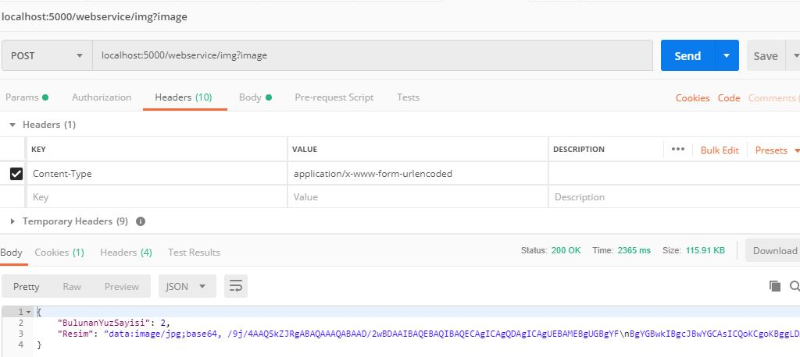
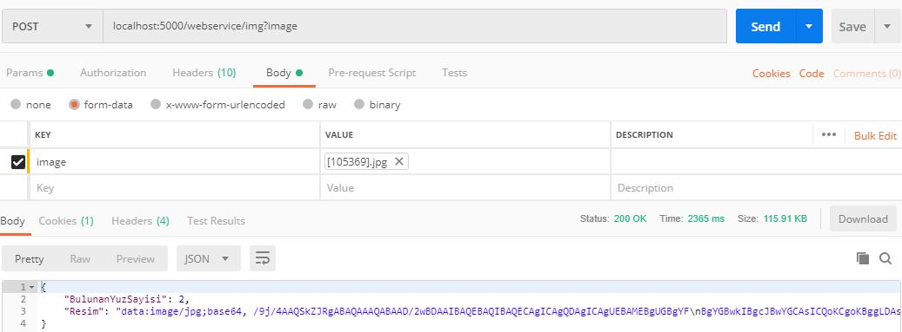
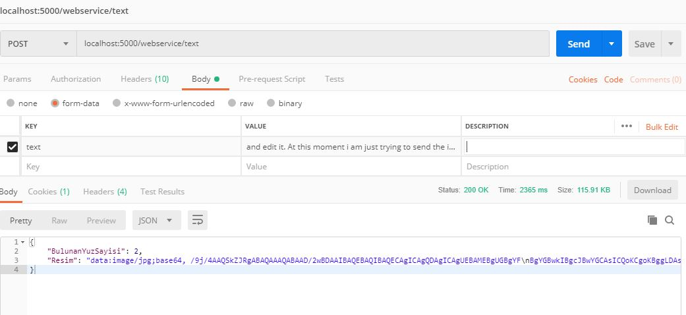

Hi! You are use to Postman for request to web servis. You must select this options.\
*IF you want request to image, your key 'image' else Postman key 'text'.\
*Web servis return a base64 format for image. You should  convert base64 to image.\
**For Img**
*1.1 First Step.*

*1.2 Second Step.*

**For Text**

